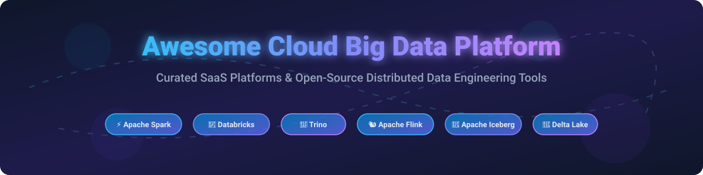

# ⚡ Awesome Cloud Big Data Platform 🚀

  

  
  
  
  
  

---

## 📌 Overview & SEO Summary 🔍

Welcome to the definitive **Awesome Cloud Big Data Platform** directory! This repository maintains a curated list of top-tier **SaaS cloud platforms**, **managed lakehouses**, and high-performance **open-source data engineering tools**. Whether you are building real-time stream processing pipelines, federated SQL engines, or scalable enterprise data lakes, this list serves as a comprehensive reference guide for data engineers, data architects, and analytics teams.

**Keywords & Topics**: Cloud Big Data, Managed Apache Spark, Data Lakehouse, Apache Flink, Trino SQL, Databricks, Amazon EMR, Google Dataproc, Azure HDInsight, Apache Iceberg, Delta Lake, Real-time Analytics, Distributed Computing, Stream Processing.

**Last updated: October 2026** 📅

---

## 📖 Table of Contents 📑

- [☁️ SaaS/Hosted Platforms](#-saashosted-platforms)
- [🔓 Open-Source GitHub Projects](#-open-source-github-projects)
- [🤝 How to Contribute](#-how-to-contribute)
- [💖 Support & Sponsorship](#-support--sponsorship)
- [⚠️ Disclaimer](#-disclaimer)
- [📈 Star History](#-star-history)

---

## ☁️ SaaS/Hosted Platforms 🌐

> **📊 Market Context & Industry Landscape**: The global big data analytics market is estimated at **~$348B in 2026**, growing toward **~$924B by 2032** at a **~17.8% CAGR** (Fortune Business Insights / MarketsandMarkets estimates). The sector is **moderately concentrated** at the platform tier — **Databricks** leads the market with **$7B+ annualized revenue** and a **$190B valuation**, followed by major cloud hyperscalers (AWS EMR, Google Cloud Dataproc, Azure HDInsight) and enterprise mainstays like **Cloudera**. Mid-market platforms (Starburst, Qubole, Upsolver) provide specialized lakehouse query and real-time ingestion capabilities. No single vendor holds a winner-take-all monopoly; enterprise architectures predominantly rely on multi-cloud, hybrid data lakehouse stacks.

Platforms are sorted by company size, annualized revenue, and market valuation (descending) 📉:

| Platform 🏢 | Description 📝 | Pricing (Starting Tier) 💰 | Free Tier / Trial Limits 🎁 | Company Size / Valuation 📊 |
|:---|:---|:---|:---|:---|
| **[Amazon EMR](https://aws.amazon.com/emr/)** | Managed Hadoop, Spark, Hive, Presto, and Flink service on AWS. | **$0.015/hour per instance** (EMR service fee) + underlying EC2 instance costs. Spot instances save up to 90%. | **AWS Free Tier**: 100 GB S3 warm storage free for 12 months for new accounts; no perpetual free EMR service tier. | **~$638B revenue (Amazon FY2025)** |
| **[Google Cloud Dataproc](https://cloud.google.com/dataproc)** | Managed Spark and Hadoop cluster service on GCP. | **$0.01/vCPU/hour** Dataproc management fee + underlying Google Compute Engine VM costs. | **$300 free credits** for 90 days for new GCP accounts; no perpetual free Dataproc tier. | **~$350B revenue (Alphabet FY2025)** |
| **[Azure HDInsight](https://azure.microsoft.com/en-us/products/hdinsight/)** | Enterprise managed cloud service for open-source analytics (Spark, Hadoop, Kafka). | **$0.075/hour** (F1 node equivalent base compute) + core-hour licensing fees. | **$200 Azure free credit** for 30 days for new accounts; no perpetual free HDInsight tier. | **~$281B revenue (Microsoft FY2025)** |
| **[Databricks](https://www.databricks.com/)** | Unified lakehouse platform built on Apache Spark with SQL Serverless & ML. | **$0.70/DBU** (SQL Serverless); **$0.55/DBU** (SQL Classic); **$0.22/DBU** (SQL Pro). | **14-day free trial** with full platform capabilities; no perpetual free tier. | **$7B+ ARR, $190B valuation, $5B raised (2026)** |
| **[Cloudera Data Platform](https://www.cloudera.com/)** | Hybrid enterprise data platform for Data Engineering, Warehousing, and AI. | **$0.04/CCU** (Data Hub); **$0.07/CCU** (Data Engineering Core); **$0.20/CCU** (AI Workbench). | **None** — Enterprise sales engagement required; no public free trial or free tier. | **Private enterprise, FY2026 record revenue & 50%+ YoY ARR growth** |
| **[Treasure Data](https://www.treasuredata.com/)** | AI-native Customer Data Platform & big data behavioral engine. | **Annual enterprise subscription** based on customer profiles & event volumes (custom quote). | **None** — Enterprise sales contact required; trade-up program offers up to 24 months free switch credit. | **Private (~$230M+ total funding raised)** |
| **[Starburst](https://www.starburst.io/)** | Enterprise Trino platform for federated data access & multi-cloud queries. | **$0.50/credit** (Galaxy Pro); **$0.75/credit** (Enterprise); **$1.00/credit** (Mission-Critical). | **Free forever**: Up to 3 compute clusters in Starburst Galaxy. **30-day trial**: $500 in Galaxy credits. | **$100M+ ARR (2025), ~40% YoY growth, $20M AI ARR** |
| **[Qubole](https://www.qubole.com/)** | Autonomous data lake platform with workload-aware autoscaling on AWS/GCP/Azure. | **$0.24/QCU/hour** + **$108/user/month** (On-Demand standard tier). | **30-day free trial**; **Business Edition**: Free tier up to 30,000 QCPU/month limit (~$1,000 value). | **Private (~$100M+ raised, acquired by Idera)** |
| **[Upsolver](https://www.upsolver.com/)** | Continuous ingestion and automated Apache Iceberg table optimization platform. | **Consumption-based pricing** by data volume ingested (starts ~$0.10/GB processed). | **14-day free trial** available upon account registration. | **Private (Acquired by Qlik in 2024)** |
| **[Ahana Cloud](https://ahana.io/)** | Fully managed Presto / Trino cloud service on AWS. | **Pay-as-you-go credit usage fee** starting via AWS Marketplace listing. | **14-day free trial** accessible directly via AWS Marketplace listing. | **Private (Acquired by IBM in 2023)** |

---

## 🔓 Open-Source GitHub Projects 🛠️

Sorted by GitHub star count (descending) 🌟. Star badge links directly to each repo's stargazers page!

| Repo 📦 | Description 📝 | Stars ⭐ |
|:---|:---|:---|
| **[Apache Spark](https://github.com/apache/spark)** | Unified analytics engine for large-scale data processing. Batch, streaming, SQL, ML, and graph processing. |  |
| **[Apache Kafka](https://github.com/apache/kafka)** | Distributed event streaming platform for high-throughput real-time data pipelines. |  |
| **[DuckDB](https://github.com/duckdb/duckdb)** | In-process analytical database (OLAP). Ultra-fast queries on local Parquet, CSV, and JSON files. |  |
| **[Apache Flink](https://github.com/apache/flink)** | Stateful computations over unbounded and bounded data streams with exactly-once processing guarantees. |  |
| **[Presto (prestodb)](https://github.com/prestodb/presto)** | Distributed SQL query engine for big data. Originally created at Facebook. |  |
| **[Apache Hadoop](https://github.com/apache/hadoop)** | Distributed framework for massive dataset storage (HDFS) and cluster compute processing (MapReduce, YARN). |  |
| **[Apache Cassandra](https://github.com/apache/cassandra)** | Distributed NoSQL database for high availability and linear scalability across data centers. |  |
| **[Apache Doris](https://github.com/apache/doris)** | MPP-based real-time data warehouse for sub-second analytical reporting and dashboards. |  |
| **[Trino](https://github.com/trinodb/trino)** | High-performance distributed SQL query engine for federated queries across data lakes and databases. |  |
| **[StarRocks](https://github.com/StarRocks/starrocks)** | Next-generation sub-second MPP data platform for real-time analytics and vectorized execution. |  |
| **[Apache Beam](https://github.com/apache/beam)** | Unified programming model for batch and stream pipelines running on Spark, Flink, and Dataflow. |  |
| **[Delta Lake](https://github.com/delta-io/delta)** | Open-source storage layer bringing ACID transactions and schema enforcement to Apache Spark. |  |
| **[Apache Iceberg](https://github.com/apache/iceberg)** | High-performance open table format for huge analytic datasets with schema evolution and time travel. |  |
| **[Apache Storm](https://github.com/apache/storm)** | Distributed real-time computation system for processing high-velocity stream tuples. |  |
| **[Apache Druid](https://github.com/apache/druid)** | High-performance real-time analytics database designed for fast SQL queries on event data. |  |
| **[Apache Hudi](https://github.com/apache/hudi)** | Streaming data lake platform supporting ACID upserts, incremental ingestion, and fast queries. |  |
| **[Apache Pinot](https://github.com/apache/pinot)** | Real-time distributed OLAP datastore designed for low-latency user-facing analytics. |  |
| **[Apache Kylin](https://github.com/apache/kylin)** | Extreme OLAP engine providing sub-second SQL queries on massive datasets via pre-computed cubes. |  |

---

## 🤝 How to Contribute 💡

Contributions are always welcome! Help keep this cloud big data resource updated:

1. **Fork** this repository.
2. Add or update entries in `README.md` following the exact table structure.
3. Keep descriptions concise, objective, and factual with official website links.
4. Open a **Pull Request** with a summary of changes.

Check out [Awesome-Awesome-Awesome](https://github.com/ishandutta2007/Awesome-Awesome-Awesome) for more curated lists! 🚀

---

## 💖 Support & Sponsorship ☕

If you find this repository helpful for your work, data engineering projects, or cloud platform research, please consider supporting the project:

- ⭐ **Star** this repository to increase visibility!
- 🔀 **Fork** and share with fellow data engineers and architects.
- ☕ **Buy me a coffee**: Support ongoing maintenance on the [GitHub Sponsor Dashboard](https://github.com/sponsors/ishandutta2007).

Thank you for being part of the cloud data community! 🙏

---

## ⚠️ Disclaimer 📄

- This directory is **community-curated** for reference purposes only and does not imply official endorsement.
- All pricing, tier limits, and market valuations are verified against public documentation as of **October 2026** but remain subject to change by respective vendor offerings.
- Managed infrastructure charges (e.g. EC2, GCE, S3 storage) are typically billed separately by cloud providers.

---

## 📈 Star History ⭐

---

  <b>Built for Data Engineers, Data Architects, and Platform Teams worldwide.</b>

